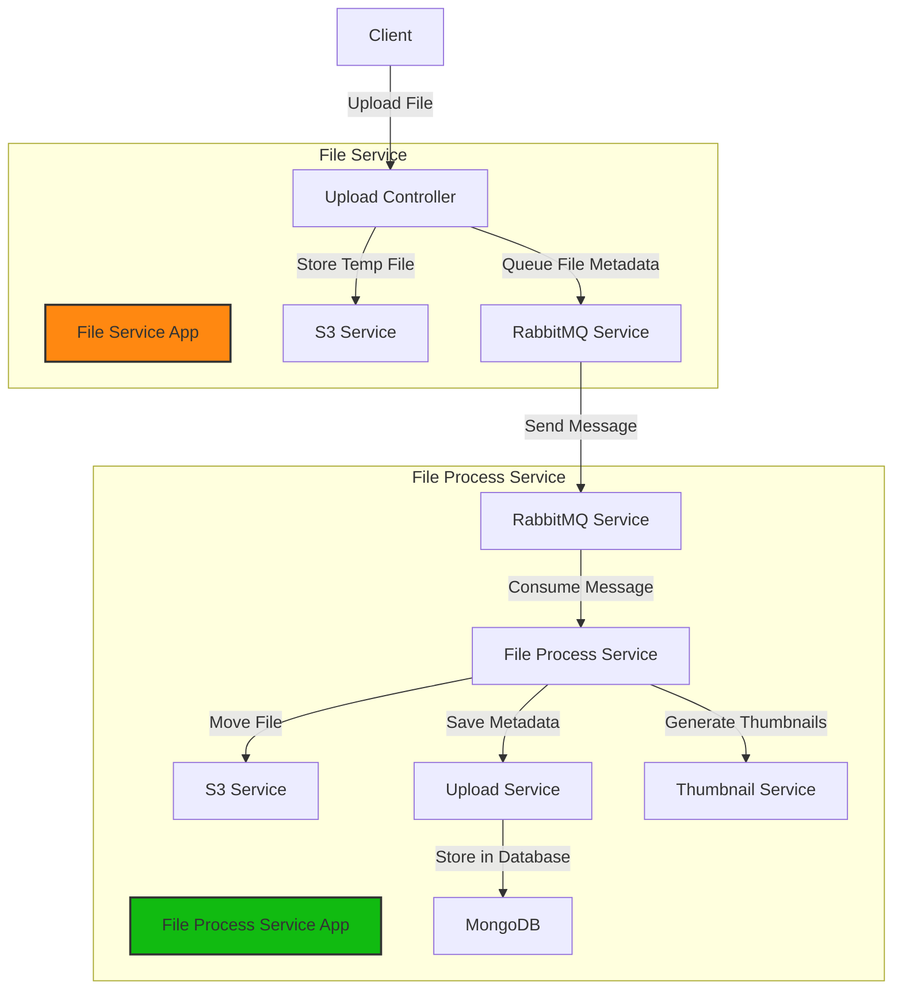

### Mermaid Diagram for File Service and File Process Service

```mermaid
graph TB
subgraph "File Service"
FS[File Service App]
FS_Upload[Upload Controller]
FS_S3[S3 Service]
FS_RabbitMQ[RabbitMQ Service]
end

    subgraph "File Process Service"
        FPS[File Process Service App]
        FPS_Process[File Process Service]
        FPS_S3[S3 Service]
        FPS_Upload[Upload Service]
        FPS_Thumbnail[Thumbnail Service]
        FPS_RabbitMQ[RabbitMQ Service]
        FPS_Mongo[MongoDB]
    end

    Client[Client] -->|Upload File| FS_Upload
    FS_Upload -->|Store Temp File| FS_S3
    FS_Upload -->|Queue File Metadata| FS_RabbitMQ
    FS_RabbitMQ -->|Send Message| FPS_RabbitMQ
    FPS_RabbitMQ -->|Consume Message| FPS_Process
    FPS_Process -->|Move File| FPS_S3
    FPS_Process -->|Generate Thumbnails| FPS_Thumbnail
    FPS_Process -->|Save Metadata| FPS_Upload
    FPS_Upload -->|Store in Database| FPS_Mongo

    style FS fill:#f81,stroke:#333,stroke-width:2px
    style FPS fill:#1b1,stroke:#333,stroke-width:2px
```
